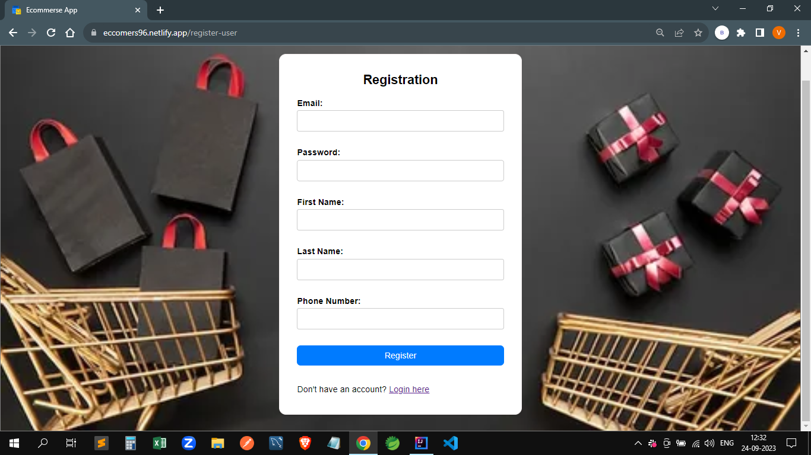
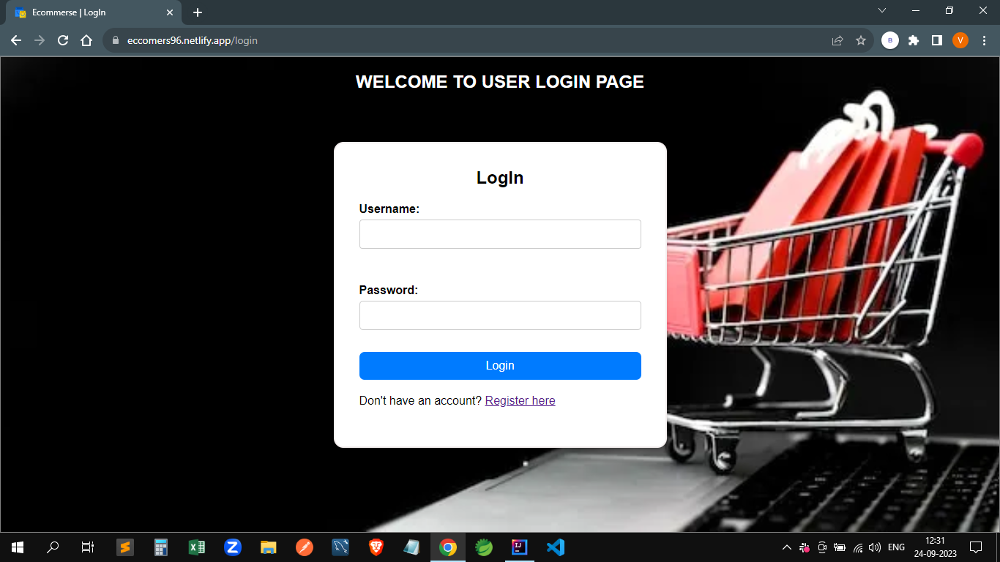
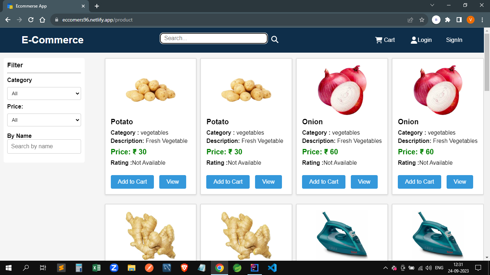
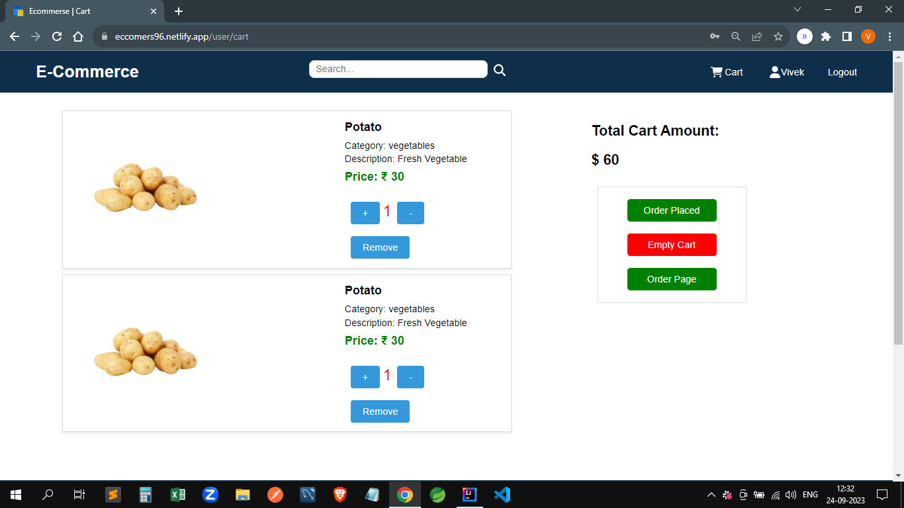
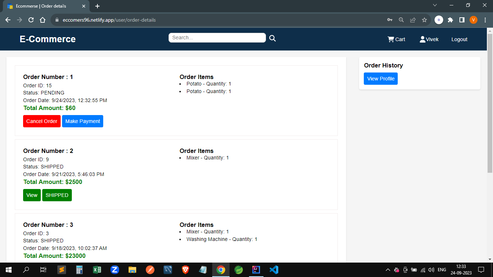
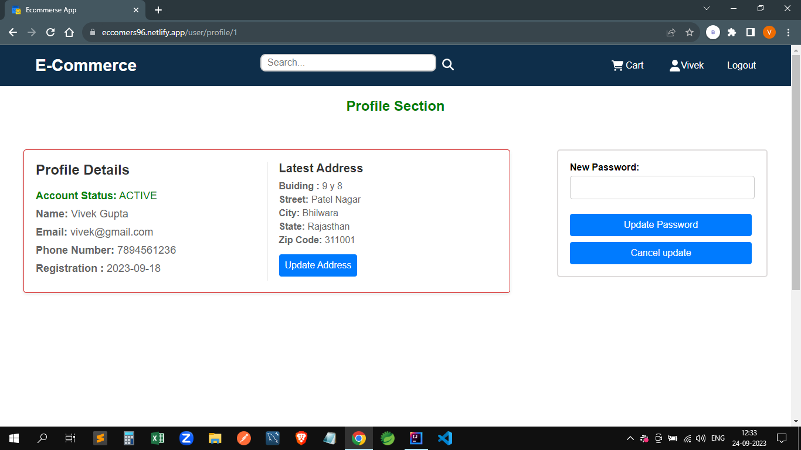
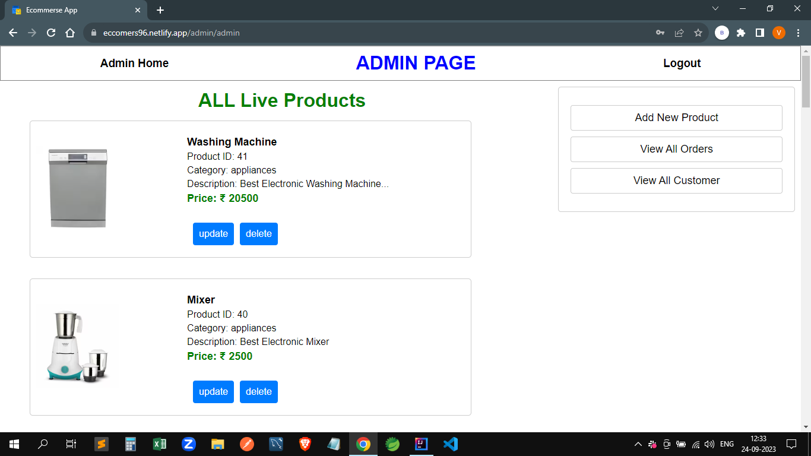
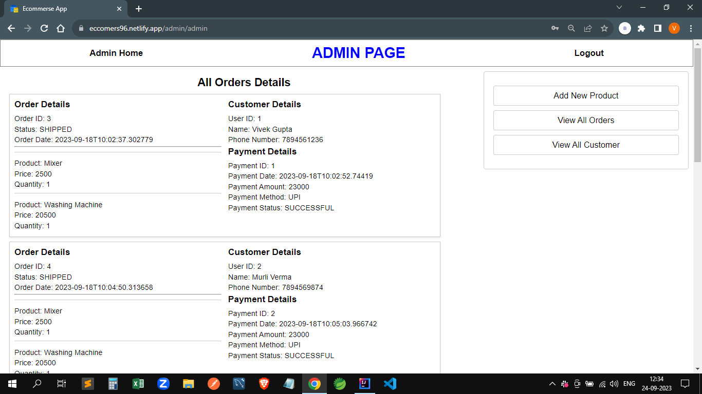
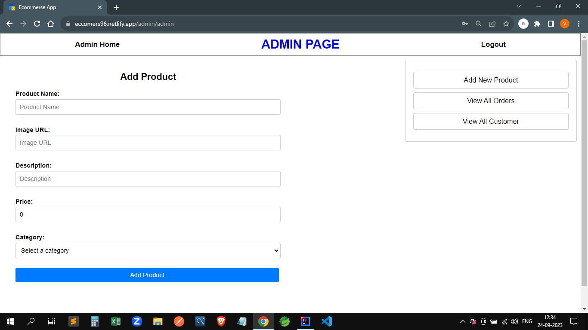
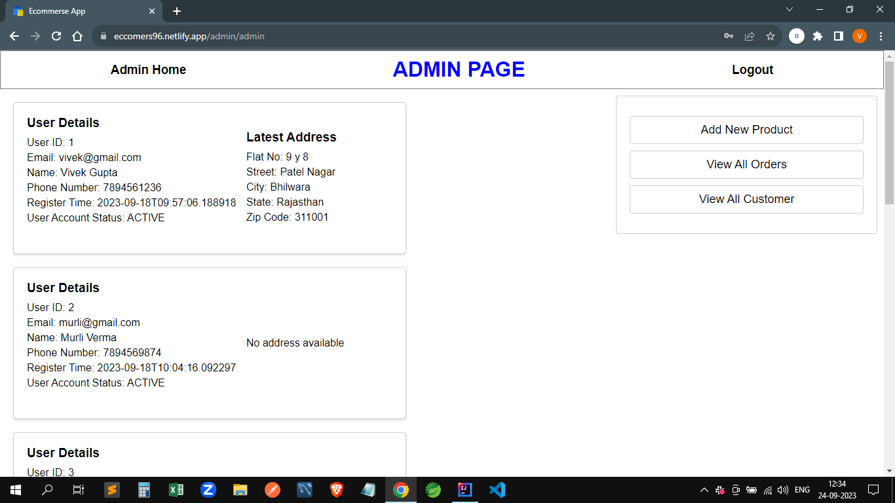

# 🛍️ E-Commerce Platform – Full Stack Shopping Application

A beginner to intermediate full-stack shopping platform built with **React**, **Spring Boot**, and **MySQL**. This project demonstrates the integration of modern frontend and backend technologies with robust features like product management, user authentication, order placement, and secure payment handling.

---

## 🔍 Overview

This project is a full-featured **E-Commerce Application** that allows users to register, browse products, manage their cart, and place orders. The backend is powered by **Spring Boot** and **MySQL**, while the frontend is developed using **React** with responsive UI.

---

## 🚀 Features

- 👤 User Signup/Login (with JWT & BCrypt Security)  
- 🔒 Secure Authentication and Role-based Authorization  
- 🛒 Add to Cart & Checkout  
- 🧾 Dynamic Order Summary  
- 📦 Product Filtering, Sorting & Pagination  
- 💳 Payment Integration (Razorpay)  
- 🧑‍💼 Admin Product Management  
- 📱 Responsive and Clean UI  
- 🧠 State Management using Redux  
- 🖼️ Product Images and Carousel  
- 📦 Backend APIs secured with Spring Security  

---

## 🧩 Tech Stack & Tools

| Technology       | Role                            |
|------------------|----------------------------------|
| Java             | Backend Language                |
| Spring Boot      | Backend Framework               |
| Spring Data JPA  | ORM Layer                       |
| Hibernate        | ORM Implementation              |
| MySQL            | Relational Database             |
| Spring Security  | Authentication & Authorization  |
| JWT, BCrypt      | Secure Token-based Auth         |
| React            | Frontend Library                |
| Redux            | State Management                |
| TailwindCSS / MUI| UI Design & Layout              |
| Axios            | HTTP Client for API Requests    |
| Maven            | Build Tool                      |

---

## 📸 Final Output Screenshots

Here are screenshots showing the key parts of the application:

### 📝 Register Page


### 🔐 Login Page


### 🏠 Home Page with Product Listings


### 📦 Product Details Page


### 🛒 Cart Page


### 📜 Order History Page


### 👤 User Profile Page


### 🛠️ Admin Dashboard


### 📋 All Orders Details Page


### ➕ Add Product Page (Admin)


### 👥 All Users Page (Admin)


---

## ⚙️ Setup Instructions

1. Clone the repository

2. Backend Setup

```bash
cd backend
./mvnw spring-boot:run
```

3. Frontend Setup

```bash
cd frontend
npm install
npm start
```

## 🙌 Credits

Created with ❤️ by Rohit Dhumal.

